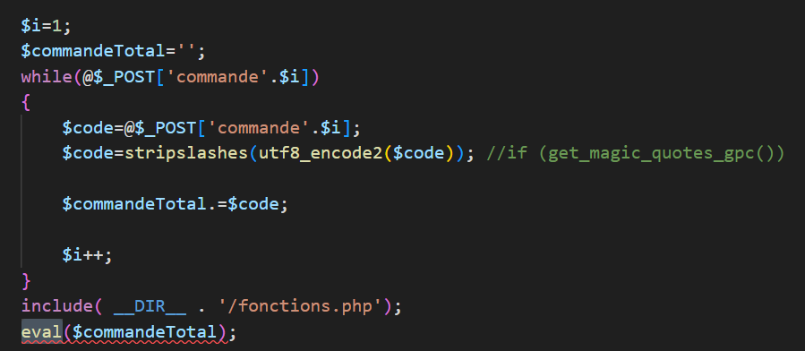

TL;DR tried to write a PoC for [CVE-2025-8417](https://cvefeed.io/vuln/detail/CVE-2025-8417), an 8.1 CVSS RCE in WordPress plugin intelligent-importer 5.1.4. Discovered the key needed can't be brute-forced or reversed (by me) -- but there's XSS in a downgraded version, 5.1.3, that might be able to steal it when paired with phishing. Lame, I know.

If you, somehow, have the clef/key, then you can exploit this plugin via this web request:

```
POST /wordpress/?megaimporter_communication=1&clef=CLEF HTTP/1.1
Host: your-host
sec-ch-ua: "Not=A?Brand";v="24", "Chromium";v="140"
sec-ch-ua-mobile: ?0
sec-ch-ua-platform: "Windows"
Upgrade-Insecure-Requests: 1
User-Agent: Mozilla/5.0 (Windows NT 10.0; Win64; x64) AppleWebKit/537.36 (KHTML, like Gecko) Chrome/140.0.0.0 Safari/537.36
Accept: text/html,application/xhtml+xml,application/xml;q=0.9,image/avif,image/webp,image/apng,*/*;q=0.8,application/signed-exchange;v=b3;q=0.7
Sec-Fetch-Site: none
Sec-Fetch-Mode: navigate
Sec-Fetch-User: ?1
Sec-Fetch-Dest: document
Accept-Encoding: gzip, deflate, br, zstd
Accept-Language: en-US,en;q=0.9
Content-Type: application/x-www-form-urlencoded
Content-Length: 33
Cookie: wp-settings-time-1=1758064407

setCommandes=1&commande1=sleep(10);
```

If you don't, then I fear you may be SOL. Below is the post I wrote during my research, blissfully unaware of the challenges that would come.

---

Figured since I'm a student I might as well have something to show for it. Wordpress plugin vulns have an incredibly special place in my heart, and so do the people that write public exploits. Here's my entry.

1) find appropriate CVE on [cvefeed](https://cvefeed.io/vuln/detail/CVE-2025-8417) (no public exploits, higher criticality, RCE, unauth preferred)
2) find plugin on wordpress.com
3) it's gone?
4) oh wrong site
5) find plugin on [wordpress.org](https://wordpress.org/plugins/intelligent-importer/)
6) it's down! no doubt because of the unauthenticated arbitrary RCE...
7) [wayback machine](https://web.archive.org/web/20250712032821/https://wordpress.org/plugins/intelligent-importer/) indexed it, thankfully
8) [link to the download](https://web.archive.org/web/20250712032821/https://downloads.wordpress.org/plugin/intelligent-importer.5.1.4.zip) exists, but hasn't been indexed
9) the [downloads.wordpress.org base link](https://downloads.wordpress.org/plugin/intelligent-importer.5.1.4.zip), however, is still perfectly functional. (there's also a [github mirror](https://github.com/common-repository/intelligent-importer))
10) i have the plugin!
11) [download and set up XAMPP and wordpress](https://medium.com/@aawesomespace/how-to-host-a-wordpress-website-on-your-own-windows-1c9a91c5ed71) for local testing [1]
12) we do a little code review while xampp is installing...

"Vulnerable to PHP code injection" \[...] "due to reliance on a guessable numeric token (e.g. ?key= 900001705)" \[...] "combined with the unsafe use of eval() on user-supplied input." Makes RCE possible "via a forged request granted they can guess or brute-force the numeric key." So, find the POST params, find where eval() is being used on user-supplied input, how the key is being generated, and how to guess or brute-force it; then stuff that into a bash script that takes a URL and path as arguments to execute `sleep()` (because we're moral here).

There are two places eval() is being called [2]: 




These are part of a large if/else statement meant to handle various POSTs(??), the first being part of `setCommandesMulti` and the second being part of `setCommandes`. I'll focus on the second for now. I *thought* the "guessable numeric token" was `i`, but it turns out it is actually a URL parameter called `clef` -- more on that later. `i` just dictates the order of command execution.

Problem: how and when are these POSTs being made? After sniffing around, I found that a `POST /wordpress/wp-content/plugins/intelligent-importer/communication.php` gives a 200 OK, meaning this could be our endpoint. I tried a couple simple payloads before realizing it wasn't... working, so I looked back at the code and realized absolutely nothing else referenced `setCommandes` or its ilk, so another program must be making these POSTs. 

Enter intelligent_importer.exe, or Grimport Crawler. In the WP module for the plugin there's a "recommended method" for running the analysis, which takes you to a link download for the Intelligent Importer installer. Installed it. Opened it. Didn't like the interface. Decompiled the `run.jar` using [an online decompiler](https://www.decompiler.com/jar/5d073a65e3f34728b84f5804c924615d/run.jar) [3]. Found our POSTing endpoint; it's actually just `/wordpress/?megaimporter_communication=1&clef=[CLEF]`. Clef is French for 'key,' and it's our "guessable" numeric token. 

`clef` is created upon plugin installation by nabbing a random value between 1 and 999,999,999, see below. Which only gives us about a billion options. How the hell am I going to guess that? [4] [5] I'm starting to see why the CVE wasn't given a 9.8.

`update_option('megaimporter_clefacces',mt_rand(1,999999999));`

`clef` *is* actually being validated in this line here:

`if(get_option('megaimporter_clefacces')!=@$_GET['clef']) die('Erreur k1');` (fails closed)

So no cheese for us. At this point, I've run through all my easy options. Surely I won't have to reverse `mt_rand`. "I can't reverse `mt_rand`," I said to myself four hours ago. I was right. *I* can't. But [someone else already has](https://blog.lexfo.fr/php-mt-rand-prediction.html). 

I looked for other places `mt_rand` was being called in the plugin code; it was, in a few places, used for the creation of filenames for file uploads. Thought to myself, if I can just make grimport_crawler upload 228 files (228 being the amount of `mt_rand` values needed to crack `mt_rand`), I could feed it to the pre-written `mt_rand`-cracking-program and presto. ...However, those function calls to create those `mt_rand` generations... also need the `clef`.

I then focused my attention on the `clef` validation line above. Could I use the loose comparison/type juggling (`!=`) to my advantage? Could I escape the $_GET? I spent an hour or two on lines of thought like these before concluding that, if it were possible, it wouldn't be done by me. 

Other ideas were explored, but not written down immediately, and as such were forgotten. If you've thought of anything you think I haven't, feel free to contact me.

My current lines of thought are as such. If a website using this plugin has been up for a while, and has called these functions by using the Grimport Crawler on the site (e.g. normal function), it could theoretically be possible to nab 2 of them 226 values apart and crack the `clef`.

My second idea: 5.1.4 is a security fix for 5.1.3, which had a reflected XSS vulnerability [CVE-2025-22775](https://www.cve.org/CVERecord?id=CVE-2025-22775) that I can't find too much about. I can, however, [look at the diffs](https://plugins.trac.wordpress.org/changeset/3207517/) if I wanted to figure out exactly where this was happening. *Could I* use this to grab the `clef`? It's written in plaintext in an admin-side configuration panel. Could this be paired with a phishing attempt to grab the `clef`?

These are questions that I, unfortunately, don't have the time to answer. This was a good exercise in code review and getting something from nothing, but it's also, like all things, an indictment against AI. Both the 5.1.4 vuln and the 5.1.3 vuln were AI-generated findings reported to MITRE to get published as CVEs, and as such, probably only had the minimal amount of review necessary to get them published. If any human had found the 5.1.4 vulnerability, they would have gone though the same process I had to find out that it's not *that* exploitable. Who is going to brute-force that `clef`?!

The authors of the plugin, while I was researching and writing this post, completely refactored the authentication mechanisms for the plugin. Good on them. I'm going to put this down for now and look for other WP plugin CVEs that don't have exploits, such that I might provide them.

thanks for your time :)

---
Footnotes:


[1]: "why not docker?!" you may ask. shrimple. because docker desktop was giving me way too many headaches (especially with the database connection), and my server is currently sitting unplugged in the living room, so no VM for me

[2]: lol, said the scorpion. lmao


[3]: WHY IS THERE SO MUCH SHIT IN THIS PROGRAM OH MY GOD

[4]: "doesn't intelligent_importer have to know the `clef` somehow?" yes, you as the site owner provide it in a .grl file.

[5]: "can others access that grl file?" not... really. the grl file is generated by passing parameters (including the `clef`) to `grl.php` (or `bat.php`) that just concatenates a bunch of strings together. so no stealing the `clef` from that.

[poc]: https://legacv.me/
