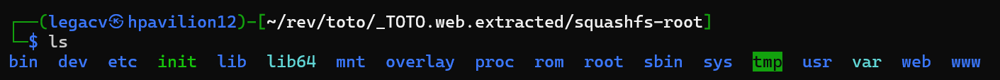

I had so much fun [in September][latest] that I'm gonna do it again. Here's my first attempt at firmware reversing, something I've always wanted to do. (Patch your systems!)

TOTOLINK has a new(ish) 9.3 critical CVE:
"Improper Neutralization of Special Elements used in an OS Command ('OS Command Injection') vulnerability in TOTOLINK X6000R allows OS Command Injection. This issue affects X6000R: through V9.4.0cu.1360_B20241207."

And a wonderful [reference](https://github.com/PaloAltoNetworks/u42-vulnerability-disclosures/blob/main/2025/PANW-2025-0002/PANW-2025-0002.md) that's my guide:
"The vulnerability exists within the `setEasyMeshAgentCfg` function, which is responsible for configuring EasyMesh agent settings. The root cause is the improper sanitization of the user-supplied `agentName` parameter before it is used to construct a system command.

An attacker can craft a request containing shell metacharacters within the `agentName` value. The firmware fails to neutralize these characters, directly concatenating the malicious input into a string that is later executed by a shell. This allows the attacker's injected payload to be executed as a separate command on the underlying operating system."

I grabbed the [firmware](https://www.totolink.net/home/menu/detail/menu_listtpl/download/id/247/ids/36.html) from TOTOLINK's site (thanks for making it so simple). Extracted, was greeted with a... .web? Threw it in hexed.it (#notsponsored) and got a `OpenWRT FIT (Flattened Image Tree)` string as well as a header of `d0 0d fe ed` (1) which confirmed the FIT format.

Used [this guide](https://fohdeesha.com/docs/firmware.html) on extracting Brocade firmware, which was applicable to me if I just didn't do the first few steps.

`dumpimage -l TOTO.web` gave me a beautiful output:

```
FIT description: ARM64 OpenWrt FIT (Flattened Image Tree)
Created:         Sat Dec  7 02:52:46 2024
 Image 0 (kernel-1)
  Description:  ARM64 OpenWrt Linux-5.4.246
  Created:      Sat Dec  7 02:52:46 2024
  Type:         Kernel Image
  Compression:  lzma compressed
  Data Size:    2926309 Bytes = 2857.72 KiB = 2.79 MiB
  Architecture: AArch64
  OS:           Linux
  Load Address: 0x48080000
  Entry Point:  0x48080000
  Hash algo:    crc32
  Hash value:   cd8ca3cb
  Hash algo:    sha1
  Hash value:   c0d87b995968814e8a6bb3f7b4cc223aaaf4c106
 Image 1 (fdt-1)
  Description:  ARM64 OpenWrt carystudio-04499a-nor device tree blob
  Created:      Sat Dec  7 02:52:46 2024
  Type:         Flat Device Tree
  Compression:  uncompressed
  Data Size:    17560 Bytes = 17.15 KiB = 0.02 MiB
  Architecture: AArch64
  Hash algo:    crc32
  Hash value:   695f3edc
  Hash algo:    sha1
  Hash value:   b5dec6fd77c5e64e04d1f890ff945d9307257c30
 Configuration 0 (config-1)
  Description:  OpenWrt
  Kernel:       kernel-1
  FDT:          fdt-1
```

Used `dtc -I dtb -O dts TOTO.web -o toto`: to turn the .web from a Device Tree Blob to a Device Tree File, then `dumpimage -T kernel -p 0 -o toto0 TOTO.web && dumpimage -T flat_dt -p 1 -o toto1 TOTO.web` to pick out the kernel and Image 1 that the `dumpimage -l` told us we had; I didn't see any setEasyMeshAgentCfg anywhere in it, though. Long story short, my friend dedbit told me that dumpimage could just be lying and got me to use `binwalk` like I could/should have done in the first place. 

Filesystem!


`grep` gives us `./web/easymesh/index.html`, `./web/static/js/topicurl.js` and some phone web files as hits for the vulnerable function. 

---
Footnotes:

(1) haha d00d feed

---
References:

(1) https://github.com/PaloAltoNetworks/u42-vulnerability-disclosures/blob/main/2025/PANW-2025-0002/PANW-2025-0002.md
(2) https://www.totolink.net/home/menu/detail/menu_listtpl/download/id/247/ids/36.html 
(3) https://fohdeesha.com/docs/firmware.html 
(4) https://www.marcusfolkesson.se/blog/flattened-image-tree/ 
(5) https://github.com/HeyMeco/easydt 
(6) https://github.com/ilovekeer/IOT/blob/main/TOTOLINK/X18/setEasyMeshAgentCfg/2.md 


[latest]: https://legacv.me/attempted-poc